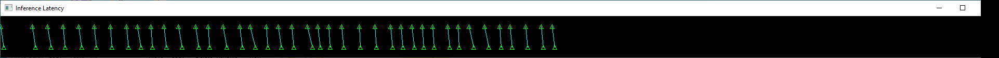
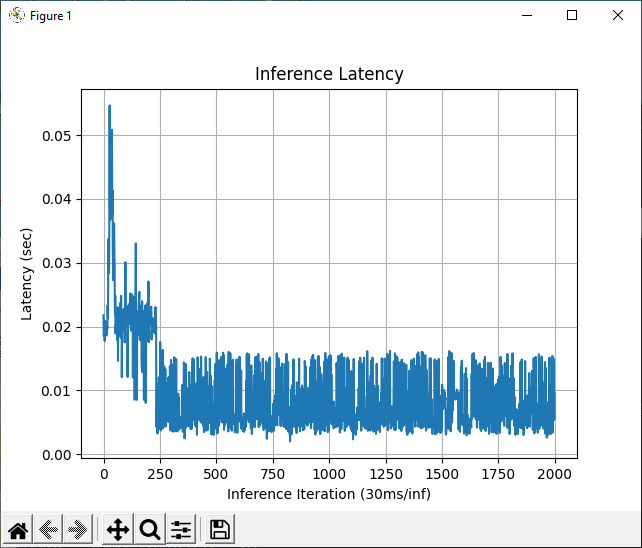
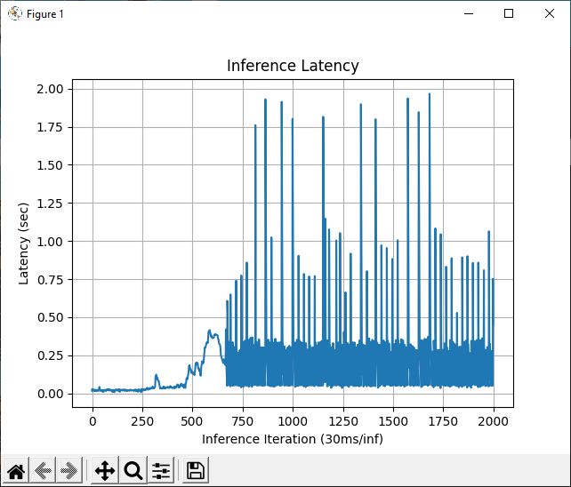

# OpenVINO "AUTO" plugin / Auto-batching feature behavior visualization tool  

## Description:  
This is a set of test programs to visualize the behavior of the "AUTO" plugin device switching and auto-batching feature that is newly introduced in the OpenVINO 2022.1 version.  

* "AUTO" plugin - Web document is [here](https://docs.openvino.ai/latest/openvino_docs_OV_UG_supported_plugins_AUTO.html).  
* Auto-batching feature - Web document is [here](https://docs.openvino.ai/latest/openvino_docs_OV_UG_Automatic_Batching.html)  

----

## How to run:

1. Install prerequisites  
```sh
python3 -m pip install -r requirements.txt
```

2. Model Preparation (googlenet-v1-tf)

Use OMZ tools to download required DL model.  
```sh
omz_downloader --list models.txt
omz_converter --list models.txt
```

3. Modify source code to change inference configuration.  

All configuration and setting parameters are hard coded in the source code. You need to modify source code to change test configuration.  

4. Run test program

* Auto-batching visualization
```sh
python3 auto-test.py
```
  


* "AUTO" plugin device switching behavior visualization
```sh
python3 auto-test-latency-graph.py
```
  



EOD
